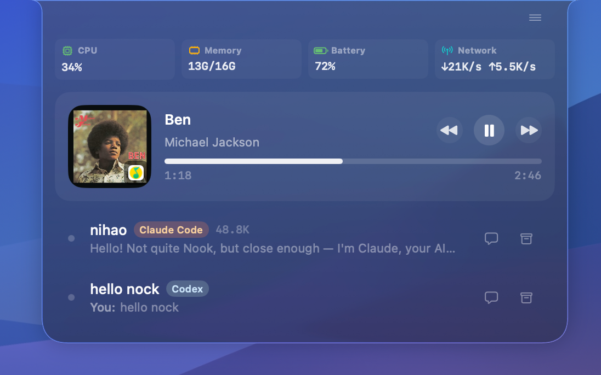
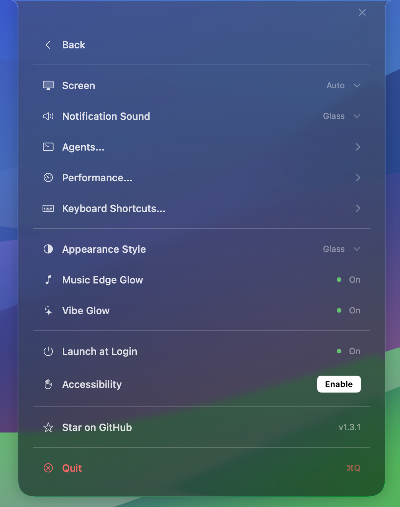
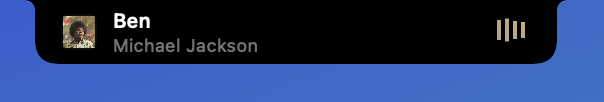

# Nook

<p align="center">
  
</p>

<p align="center">
  <strong>A live MacBook notch surface for agents, music, and system status.</strong>
</p>

<p align="center">
  <a href="./readme/README.zh-CN.md">Simplified Chinese</a> ·
  <a href="https://github.com/oa1mgo/nook-notch/releases/latest">Download latest release</a>
</p>

<p align="center">
  
</p>

<p align="center">
  
</p>

<p align="center">
  
  
  
</p>

Nook turns the MacBook notch into a compact desktop control layer. The home view keeps high-signal context in one place: Mac performance, now playing controls, and live AI coding sessions.

## What It Does

| Area | Features |
| --- | --- |
| Agent sessions | Monitor Claude Code, Codex, OpenCode, and Cursor from local hook events. |
| Session detail | Show prompts, thinking, tool calls, tool results, approvals, user questions, completion state, and token usage. |
| Music | Display artwork, source app, track metadata, progress, play/pause, previous/next, and open-source-app controls. |
| System status | Surface CPU, memory, battery, and network status with configurable performance detail pages. |
| Settings | Configure screen selection, notification sound, agent hooks, shortcuts, glow effects, launch at login, and accessibility. |
| Appearance | Switch between Music dynamic color, macOS 26+ Glass, and pure Black notch styles. |

## Agent Support

Nook normalizes local agent events into a shared session timeline.

- Claude Code: hooks, transcript parsing, status tracking, interrupt detection, permission handling, and tmux-aware terminal focus.
- Codex: hooks, transcript parsing, terminal approval state, compacting and subagent events, and stable completed-session history.
- OpenCode: event-stream integration with live tool placeholders, user-input state, subagent tracking, and idle/completion transitions.
- Cursor: session lifecycle, processing/compacting state, thought and response updates, tool calls, and session cleanup.

## Appearance

The settings page exposes three notch styles:

- `Music`: uses artwork-derived colors for the expanded notch when music is playing.
- `Glass`: uses Liquid Glass on macOS 26+ and only appears when supported.
- `Black`: keeps the expanded notch clean and solid black.

The collapsed notch stays visually quiet; the glass treatment is limited to the expanded panel.

## Install

1. Download the latest `Nook.dmg` from [Releases](https://github.com/oa1mgo/nook-notch/releases/latest).
2. Drag `Nook.app` into `Applications`.
3. Open `Nook` from `Applications`.

If macOS blocks the first launch, open `System Settings` -> `Privacy & Security`, allow Nook to run, then open it again.

## Requirements

- macOS 15.6 or later.
- macOS 26 or later for the Glass appearance option.
- Claude Code, Codex, OpenCode, or Cursor installed for the matching agent integration.
- Accessibility permission is recommended for global shortcuts and focus behavior.

## Build From Source

```bash
xcodebuild -project Nook.xcodeproj -scheme Nook -configuration Debug build
```

```bash
xcodebuild test -project Nook.xcodeproj -scheme Nook -configuration Debug -derivedDataPath build/TestDerivedData -destination 'platform=macOS'
```

See [docs/testing.md](./docs/testing.md) for testing notes.

## Project Map

- `Nook/Core`: settings, geometry, shortcuts, activity coordination, and view model state.
- `Nook/Services/Hooks`: hook installers and Unix socket ingress for agent events.
- `Nook/Services/Session`: transcript parsing, status watching, and session monitoring.
- `Nook/Services/State`: central session store and tool-event processing.
- `Nook/Services/Music`: now playing integration, media controls, and artwork color extraction.
- `Nook/Services/System`: performance sampling.
- `Nook/UI`: notch shell, session list, chat detail, music, performance, and settings views.

## Acknowledgements

Nook was shaped by ideas from:

- [farouqaldori/claude-island](https://github.com/farouqaldori/claude-island)
- [TheBoredTeam/boring.notch](https://github.com/TheBoredTeam/boring.notch)
